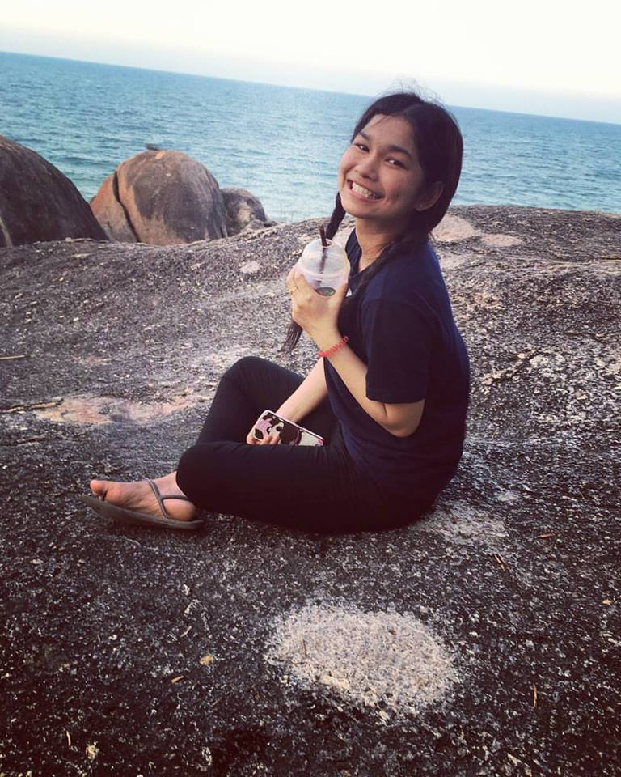
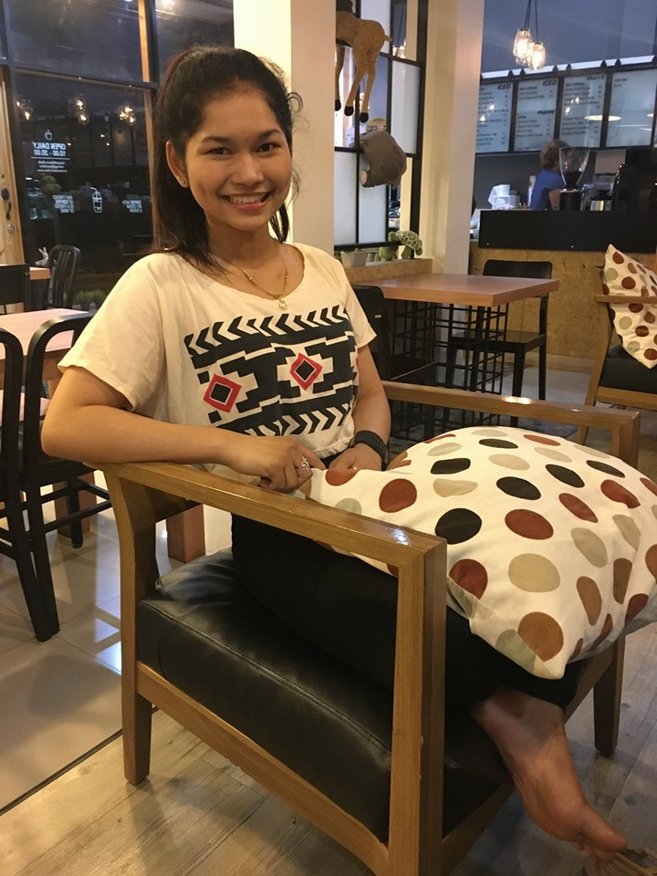
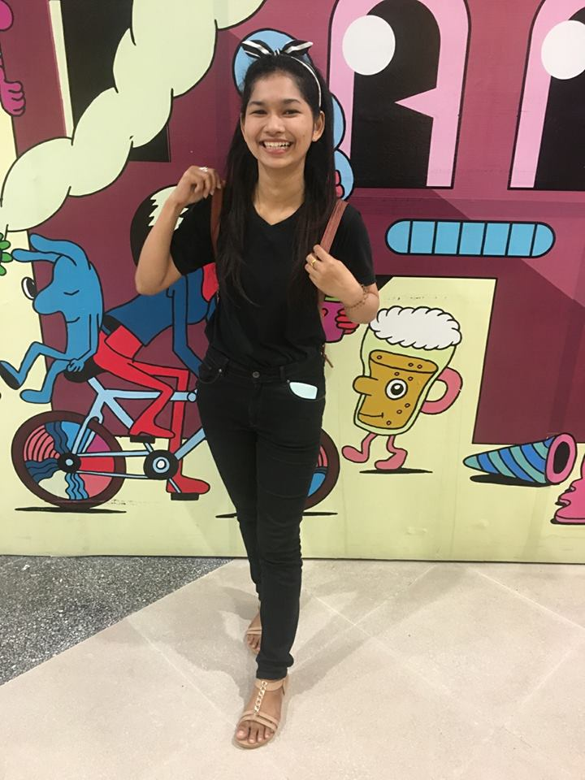
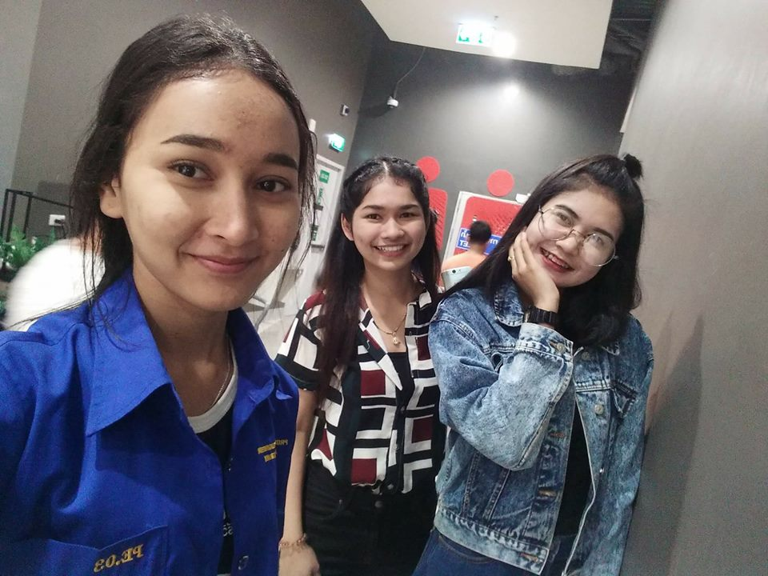

# nompangberryy<!DOCTYPE html>
<html>
<title>W3.CSS Template</title>
<meta charset="UTF-8">
<meta name="viewport" content="width=device-width, initial-scale=1">
<link rel="stylesheet" href="w3.css">
<link rel="stylesheet" href="https://fonts.googleapis.com/css?family=Raleway">

<body class="w3-light-grey w3-content" style="max-width:1600px">

<!-- Sidenav/menu -->
<nav class="w3-sidenav w3-white w3-animate-left w3-center w3-text-grey w3-collapse w3-top" style="z-index:3;width:300px;font-weight:bold" id="mySidenav"> 
  <h3 class="w3-padding-64"><b>NOMPANG BERRY</b></h3>
  <a href="javascript:void(0)" onclick="w3_close()" class="w3-padding w3-hide-large">CLOSE</a>
  <a href="#" onclick="w3_close()" class="w3-padding">PORTFOLIO</a> 
  <a href="#contact" onclick="w3_close()" class="w3-padding">CONTACT</a>
</nav>

<!-- Top menu on small screens -->
<header class="w3-container w3-top w3-hide-large w3-white w3-xlarge w3-padding-16">
  SOME NAME
  <a href="javascript:void(0)" class="w3-right w3-button w3-white" onclick="w3_open()">?</a>
</header>

<!-- Overlay effect when opening sidenav on small screens -->

<!-- !PAGE CONTENT! -->

  <!-- Push down content on small screens --> 
  

  
  <!-- Photo grid -->
  

    

      
      
    

    

      
      
    

    
    

      
      
    

  

  <!-- Pagination -->
  

    

      <a href="#" class="w3-bar-item w3-button w3-hover-black">?</a>
      <a href="#" class="w3-bar-item w3-black w3-button">1</a>
      <a href="#" class="w3-bar-item w3-button w3-hover-black">2</a>
      <a href="#" class="w3-bar-item w3-button w3-hover-black">3</a>
      <a href="#" class="w3-bar-item w3-button w3-hover-black">4</a>
      <a href="#" class="w3-bar-item w3-button w3-hover-black">?</a>
    

  

  
  <!-- Modal for full size images on click-->
  

    ?
    

      
      

    

  

  <!-- About section -->
  

    <h4><b>Nittayakan Suwannasin</b></h4>
    
    

      

      
e-mail: nittayakan.pond@hotmail.com

      
tel: 062-2182581

      

    
      

  <!-- Contact section -->
  

    

      <h4 class="w3-center"><b>Contact Me</b></h4>
      
Do you want me to photograph you? Fill out the form and fill me in with the details :) I love meeting new people!

      <form action="/action_page.php" target="_blank">
        

          <label>Name</label>
          <input class="w3-input w3-border" type="text" name="Name" required>
        

        

          <label>Email</label>
          <input class="w3-input w3-border" type="text" name="Email" required>
        

        

          <label>Message</label>
          <input class="w3-input w3-border" type="text" name="Message" required>
        

        <button type="submit" class="w3-button w3-block w3-black w3-margin-bottom">Send Message</button>
      </form>
    

  

 

</script>

</body>
</html>
